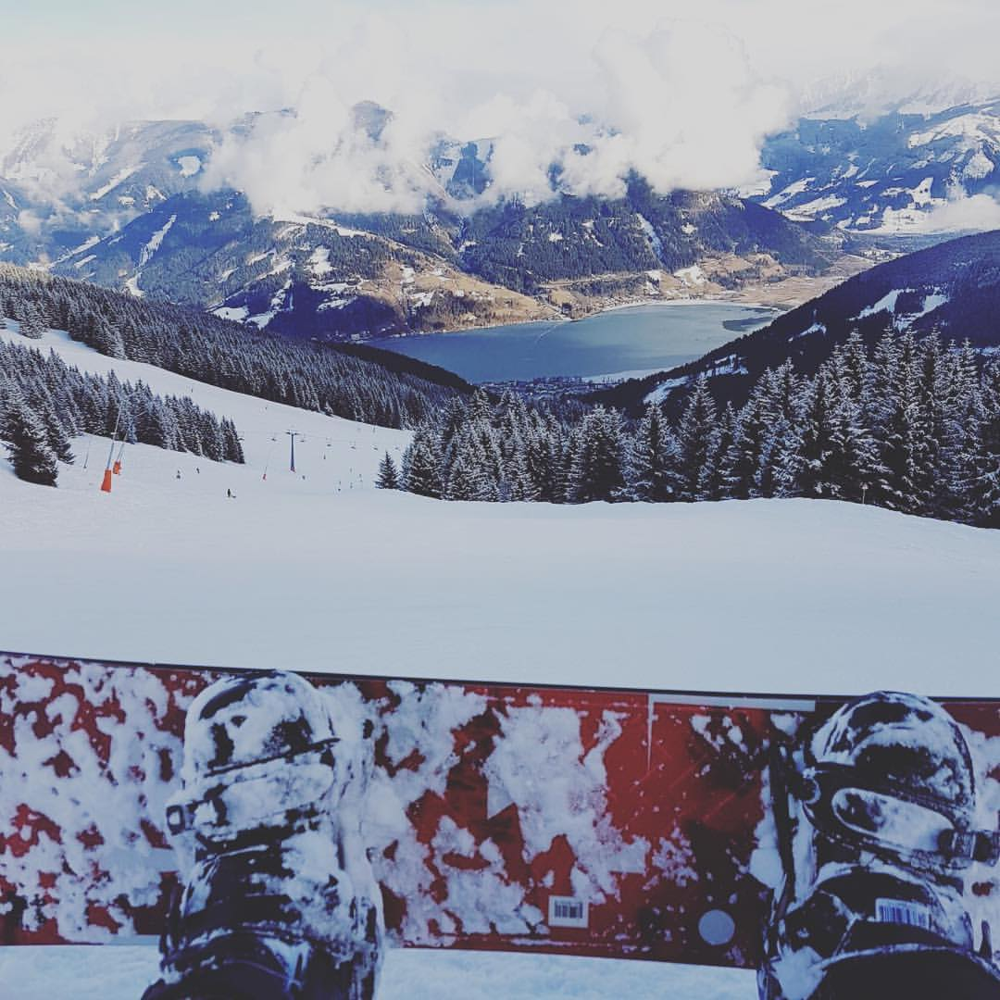
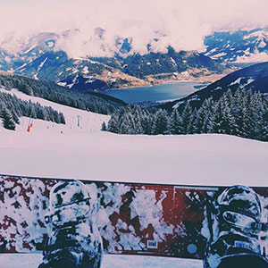
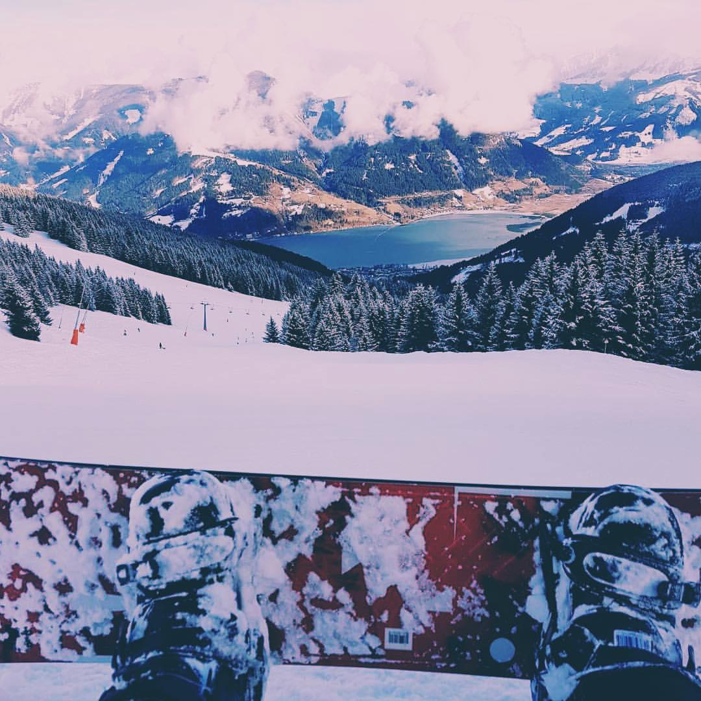
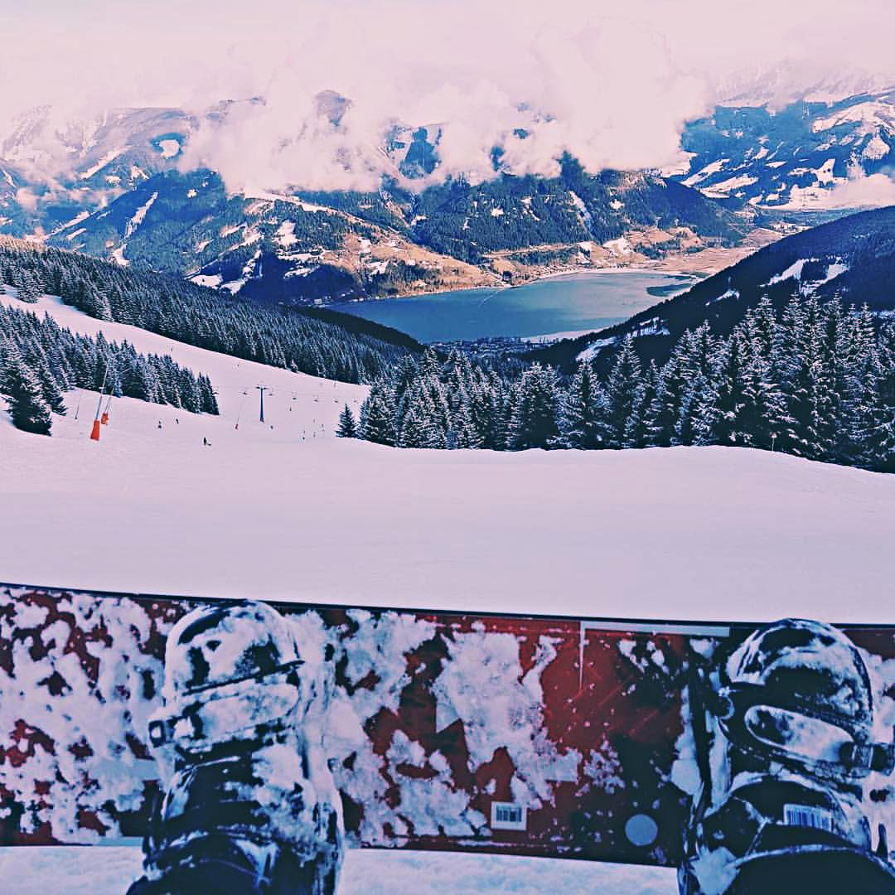
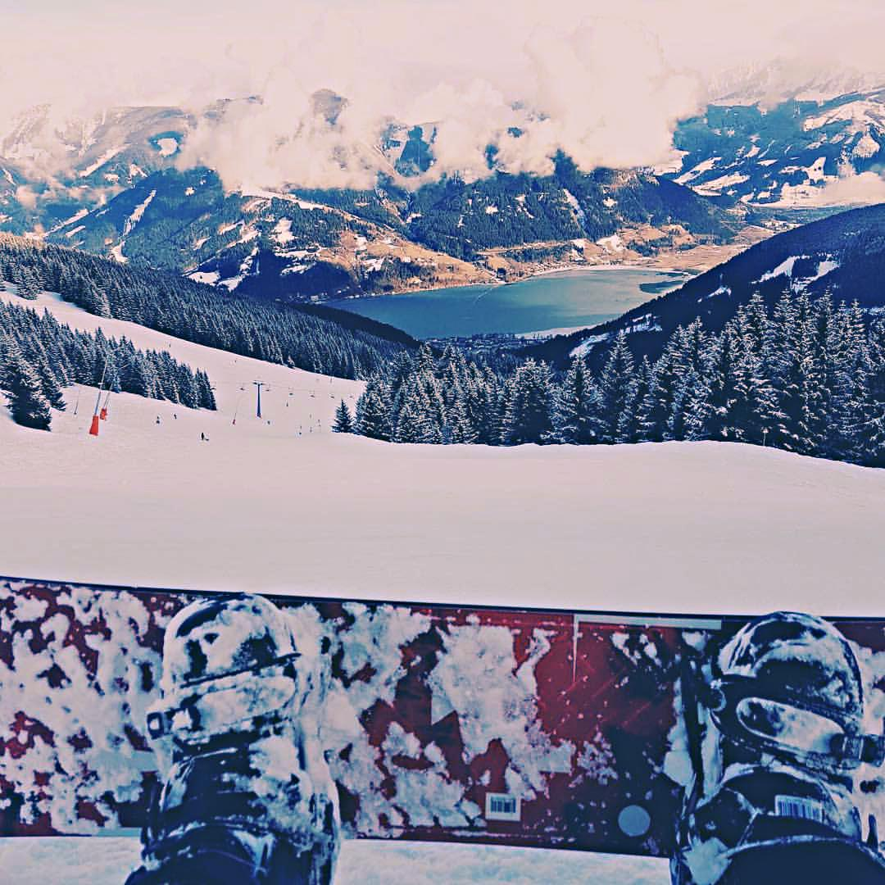
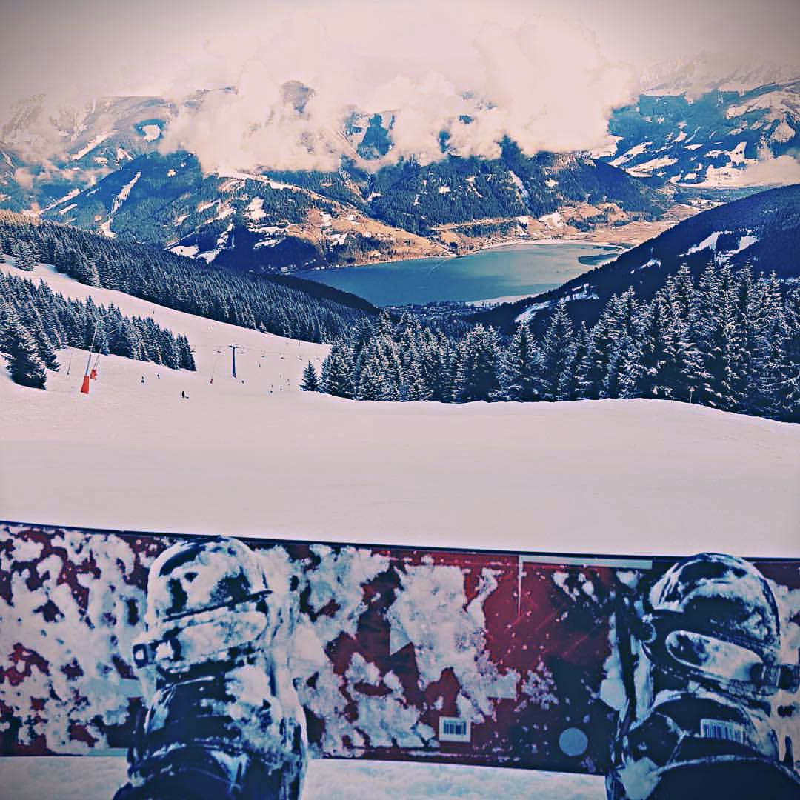

# CV-Instagram-Filters
Python remake of the Gotham Instagram filter

## Four easy steps
Using numpy, scikit-image, and a profound artistic vision
(required to copy the most popular Instagram filter available)

# Original image
A nice shot, but with a dull colour palette. Really missing a lot of
potential detail around the sky and clouds - also colours look
desaturated, and white/black balance is off on both ends.

  

# 1. Mid tone colour boost
* Lets add some vibrancy.

  

* Red snow and sky? I don't know about that..

# 2. Bluer Blacks
* Lets add some depth to the low end.

  

# 4. Sharpening the image
Now look at those fluffy trees,

  

# 5. Blue channel boost in lower-mids, decrease in upper-mids

  

# 6. Finally, add a vignette for that vintage look

  

